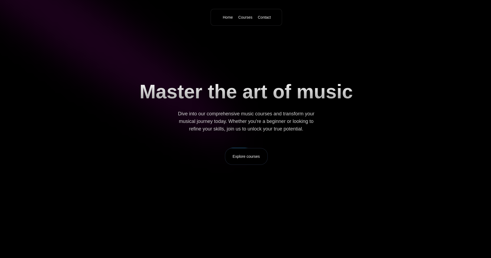

# Music Academy

Welcome to the Music Academy app, built with Next.js and TypeScript! This application is designed to provide a rich and interactive platform for music education, leveraging modern web technologies to deliver a seamless user experience.



## Table of Contents

- [Music Academy](#music-academy)
  - [Table of Contents](#table-of-contents)
  - [Introduction](#introduction)
  - [Features](#features)
  - [Technologies Used](#technologies-used)
  - [Getting Started](#getting-started)

## Introduction

The Music Academy app is a comprehensive web application developed to offer music lessons, resources, and interactive content to students and enthusiasts. Built using Next.js and TypeScript, this project showcases a sophisticated frontend architecture and a commitment to clean, maintainable code.

## Features

- **Dynamic Routing:** Seamless navigation through various pages and content using Next.js's file-based routing system.

- **TypeScript Integration:** Enhanced code quality and reliability with static type checking provided by TypeScript.
- **Responsive Design:** A fully responsive layout to ensure optimal viewing experiences across a variety of devices and screen sizes.
- **Interactive UI:** Modern and engaging user interface components built using Aceternity UI.

## Technologies Used

- **Next.js:** A powerful React framework for server-side rendering and static site generation.
- **TypeScript:** A superset of JavaScript that adds static types for improved code quality and developer experience.
- **Aceternity UI:** A design system providing a set of high-quality, reusable UI components for building elegant and functional interfaces.
- **React:** A JavaScript library for building user interfaces, particularly single-page applications.
- **CSS Modules:** Scoped and modular CSS to maintain style encapsulation and avoid conflicts.

## Getting Started

To get a local copy up and running, follow these steps:

1. **Clone the repository:**

   ```bash
   git clone https://github.com/zohaibshahzadkhan/The-Music-Academy-NextJS-.git

2. **Install dependencies:**
  ```bash
   npm install
  ```

3. **Start the development server:**
  ```bash
   npm run dev
  ```